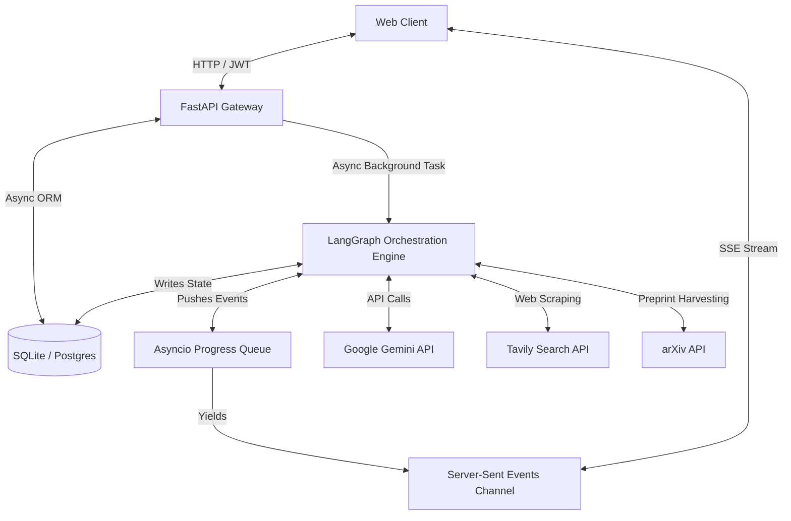
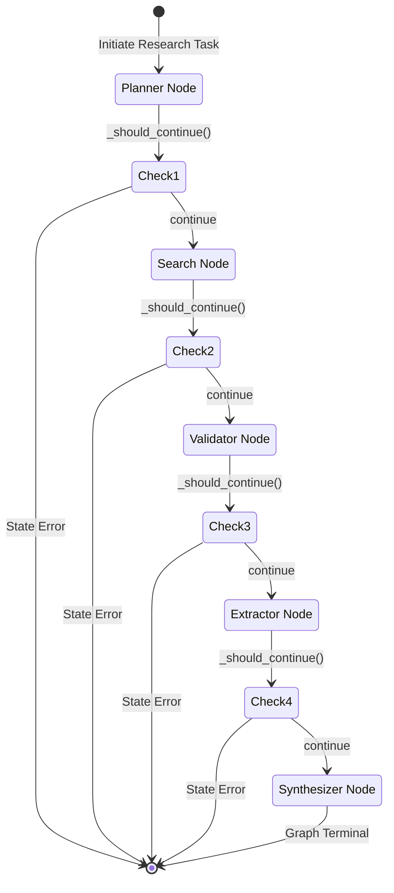

# Autonomous Multi-Agent AI Research Assistant

A production-grade, full-stack SaaS platform that performs autonomous research, literature synthesis, and academic-grade report generation. Powered by a coordinated **5-agent LangGraph workflow** on the backend and a real-time, interactive **Next.js 15 App Router** frontend.

---

## Key Features

* **Deterministic Agent Orchestration:** Built with **LangGraph** (StateGraph) to coordinate 5 specialized AI agents (Planner, Harvester, Quality Validator, Literature Reader, and Editor/Synthesizer) with robust state boundaries and error routing.
* **Streamlined Auto-Login & Sign Up:** Features a streamlined onboarding experience. Registering a brand new account automatically triggers a NextAuth session callback, logging the user in and redirecting them to the dashboard in a single click.
* **Real-Time progress Streaming (SSE):** Utilizes **Server-Sent Events (SSE)** and an async in-memory queue to stream granular node completion frames (e.g., active planning, query results, validation logs) directly to an interactive timeline in the browser.
* **Browser-Aware Token Security:** Solves standard browser `EventSource` limitations (which block custom headers) by supporting a secure, fallback JWT extraction from query parameters (`?token=...`) alongside traditional `Authorization` headers.
* **Deadlock-Free Request Interceptor:** Features an optimized Axios interceptor that skips NextAuth session retrieval on public endpoints (like `/auth/login` and `/auth/register`), preventing request deadlocks during authentication callbacks.
* **Academic-Grade Quality Scoring:** Evaluates crawled web and arXiv snippets using dynamic domain authority heuristics (favoring portals like IEEE, ACM, arXiv) and LLM scoring (relevance, recency, and technical depth) to filter only the top 8 sources.
* **Async Parallel Harvesting:** Runs web scraping, arXiv fetching, and document extraction concurrently using Python's `asyncio.gather` and model-splitting (using `gemini-2.5-flash-lite` for high-volume document summary batches and `gemini-2.5-flash` for high-reasoning tasks).
* **HTML-to-PDF Exporting:** Compiles generated reports (complete with accurate inline citations and verified bibliography links) into premium, printable PDFs using WeasyPrint.

---

## System Architecture



### LangGraph Agent Workflow


---

## Project Structure

```
research-agent/
├── .gitignore                   # Ignores local .envs, .dbs, node_modules, and virtual envs
├── docker-compose.yml           # Orchestrates Postgres database, Backend, and Frontend containers
├── README.md                    # This handover and architecture document
├── backend/
│   ├── main.py                  # API entry point, registers CORS, routers, and lifespan manager
│   ├── app/
│   │   ├── config.py            # Central Pydantic Settings defaults and key validation checks
│   │   ├── database.py          # SQLAlchemy engine and async session factories
│   │   ├── api/                 
│   │   │   ├── deps.py          # Multi-extract JWT extraction (from Headers & query parameter tokens)
│   │   │   └── v1/              
│   │   │       ├── auth.py      # Registration/Login with passlib bcrypt hashing
│   │   │       ├── research.py  # Background task pipeline initiator and EventSource streaming router
│   │   │       ├── reports.py   # Saved reports operations and listing endpoints
│   │   │       └── export.py    # Generates printable HTML-to-PDFs or downloads raw Markdown
│   │   ├── agents/              
│   │   │   ├── state.py         # Strictly-typed state dictionaries
│   │   │   ├── graph.py         # Compiles LangGraph nodes and conditional error boundaries
│   │   │   ├── planner.py       # Topic query decomposition and outline design
│   │   │   ├── search.py        # Programmatic concurrent arXiv and Tavily search
│   │   │   ├── validator.py     # LLM credibility scoring and domain authority heuristics
│   │   │   ├── extractor.py     # Concurrent document scraping and key findings extraction
│   │   │   └── synthesizer.py   # Final professional Markdown synthesis with inline citations
│   │   ├── models/              # SQLAlchemy database structures (User, Report, Source, AgentRun)
│   │   └── services/            
│   │       ├── research_service.py # Event progress queue and background execution manager
│   │       └── export_service.py   # HTML-compiled PDF generations using WeasyPrint
└── frontend/
    └── src/
        ├── app/                 # Next.js App Router directories (auth, dashboard, history, saved)
        ├── components/          
        │   ├── research/        # Dynamic research input card, timeline, and Markdown viewer
        │   └── layout/          # Sidebars, headers, and the floating BackendHealthProvider
        ├── hooks/               # useSSE (handles EventSource) & useResearch (React Query)
        └── lib/                 
            ├── api.ts           # Axios client with 3x connection retries & public bypass logic
            ├── auth.ts          # NextAuth Credentials configuration with secure AUTH_SECRET
            └── config.ts        # Centralized frontend endpoints and port fallback rules
```

---

## 🛠️ Quick Start (Local Setup)

### Prerequisites
* **Python 3.10+** (Tested on `3.12`)
* **Node.js 18+** (Tested on `20+`)
* API Keys for **Google Gemini** (via Google AI Studio) and **Tavily Search**

---

### 1. Backend Manual Setup
Navigate to the backend directory, create a virtual environment, and install dependencies:
```bash
cd backend
python -m venv .venv

# Activate virtual environment
.venv\Scripts\activate      # On Windows
source .venv/bin/activate    # On Unix

pip install -r requirements.txt
```

Create a `.env` file based on `.env.example`:
```bash
cp .env.example .env
```
Update your `.env` file with your **Gemini** and **Tavily** API keys:
```env
GEMINI_API_KEY=AIzaSy...
TAVILY_API_KEY=tvly-...
SECRET_KEY=generate-a-long-random-string-for-jwt-signing
DATABASE_URL=sqlite+aiosqlite:///./research.db
```

Launch the FastAPI backend server on port `8000`:
```bash
python -m uvicorn main:app --reload --port 8000
```

---

### 2. Frontend Manual Setup
Open a new terminal, navigate to the frontend directory, and install dependencies:
```bash
cd frontend
npm install
```

Create a `.env.local` file:
```bash
cp .env.local.example .env.local
```
Update your `.env.local` file:
```env
NEXTAUTH_URL=http://localhost:3001
NEXTAUTH_SECRET=generate-a-long-random-string-for-session-signing
AUTH_SECRET=generate-a-long-random-string-for-session-signing
AUTH_URL=http://localhost:3001
NEXT_PUBLIC_API_URL=http://localhost:8000
```

Launch the Next.js frontend dev server (configured to automatically bind to port `3001`):
```bash
npm run dev
```

---

### Full-Stack Docker Deployment
You can also run the entire secure ecosystem, including a dedicated PostgreSQL database container, with a single command:
```bash
# Ensure you have your keys configured in backend/.env first
docker compose up -d --build
```
*Port mappings will expose the Next.js frontend on `http://localhost:3001` and the FastAPI backend on `http://localhost:8000`.*

---

## Environment Variables Configuration

### Backend Environment Variables (`backend/.env`)

| Variable | Purpose | Required | Example |
| -------- | ------- | -------- | ------- |
| `DATABASE_URL` | SQLAlchemy connection URL | Yes | `sqlite+aiosqlite:///./research.db` |
| `SECRET_KEY` | Secret token used to sign backend JWTs | Yes | `8fa2e8e5...` |
| `GEMINI_API_KEY` | Google Generative AI authentication | Yes | `AIzaSy...` |
| `TAVILY_API_KEY` | Tavily Web Search API authentication | Yes | `tvly-...` |
| `FRONTEND_URL` | White-listed origin for CORS validation | No | `http://localhost:3001` |

### Frontend Environment Variables (`frontend/.env.local`)

| Variable | Purpose | Required | Example |
| -------- | ------- | -------- | ------- |
| `NEXT_PUBLIC_API_URL` | Route gateway pointing to your backend | Yes | `http://localhost:8000` |
| `NEXTAUTH_URL` | Base URL used by NextAuth for redirects | Yes | `http://localhost:3001` |
| `AUTH_SECRET` | Secret token used by NextAuth for signing | Yes | `9d8d85b3...` |
| `AUTH_URL` | Core AuthJS route target path | Yes | `http://localhost:3001` |

---

## Security Implementation Highlights

* **Token Delivery Fallback for EventSource:** Browser-native `EventSource` APIs do not support setting custom headers (like `Authorization: Bearer <token>`). To solve this, `backend/app/api/deps.py` intercepts requests to the stream endpoint and extracts tokens from the query string:
  ```python
  if not token:
      token = request.query_params.get("token")
  ```
* **Interceptors Deadlock Bypass:** When NextAuth triggers its `authorize` callback, calling `getSession()` inside global request interceptors creates a deadlock since NextAuth is still processing the sign-in session. We prevent this by checking `config.url` and bypassing the session check on public endpoints:
  ```typescript
  if (config.url?.includes("/auth/login") || config.url?.includes("/auth/register")) {
    return config;
  }
  ```
* **Password Hashing:** Passwords are cryptographically salted and hashed using **passlib bcrypt**, and sessions are validated securely using JWTs.

---

## Diagnosic Diagnostics & Self-Tests
On startup, the FastAPI server automatically executes core self-tests (verifying bcrypt hashing, JWT encryption, and database table creation) and prints a high-priority diagnostic report:
```
================================================================================
 [STARTUP] AI Research Assistant Backend Startup Diagnostics
================================================================================
 - Environment:    development
 - Database URL:  sqlite+aiosqlite:///./research.db
 - Frontend URL:  http://localhost:3001
--------------------------------------------------------------------------------
 [TEST] Running Authentication Subsystem Self-Tests...
 [OK] Authentication self-tests: PASSED
--------------------------------------------------------------------------------
 [API KEYS] Verifying API Key Configurations...
 [OK] All critical API keys are loaded successfully.
================================================================================
```
